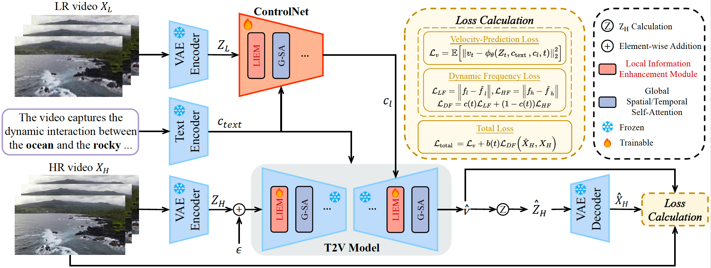

<div align="center">
    <h1>
    STAR: Spatial-Temporal Augmentation with Text-to-Video Models for Real-World Video Super-Resolution
    </h1>
    <div>
        <a href='https://github.com/CSRuiXie' target='_blank'>Rui Xie<sup>1*</sup></a>,&emsp;
        <a href='https://github.com/yhliu04' target='_blank'>Yinhong Liu<sup>1*</sup></a>,&emsp;
        <a href='https://scholar.google.com/citations?hl=zh-CN&user=yWq1Fd4AAAAJ' target='_blank'>Penghao Zhou<sup>2</sup></a>,&emsp;
        <a href='https://scholar.google.com/citations?user=Uhp3JKgAAAAJ&hl=zh-CN&oi=sra' target='_blank'>Chen Zhao<sup>1</sup></a>,&emsp;
        <a href='https://scholar.google.com/citations?hl=zh-CN&user=w03CHFwAAAAJ' target='_blank'>Jun Zhou<sup>3</sup></a><br>
        <a href='https://cszn.github.io/' target='_blank'>Kai Zhang<sup>1</sup></a>,&emsp;
        <a href='https://jessezhang92.github.io/' target='_blank'>Zhenyu Zhang<sup>1</sup></a>,&emsp;
        <a href='https://scholar.google.com.hk/citations?user=6CIDtZQAAAAJ&hl=zh-CN' target='_blank'>Jian Yang<sup>1</sup></a>,&emsp;
        <a href='https://scholar.google.com/citations?hl=zh-CN&user=Ds5wwRoAAAAJ' target='_blank'>Zhenheng Yang<sup>2</sup></a>,&emsp;
        <a href='https://tyshiwo.github.io/index.html' target='_blank'>Ying Tai<sup>1&#8224</sup></a>
    </div>
    <div>
        <sup>1</sup>Nanjing University,&emsp;<sup>2</sup>ByteDance,&emsp; <sup>3</sup>Southwest University
    </div>
    <div>
        <h4 align="center">
            <a href="https://nju-pcalab.github.io/projects/STAR" target='_blank'>
                
            </a>
            <a href="https://arxiv.org/abs/2501.02976" target='_blank'>
                
            </a>
            <a href="https://youtu.be/hx0zrql-SrU" target='_blank'>
                
            </a>
            <a href="https://huggingface.co/spaces/SherryX/STAR" target='_blank'>
                
            </a>
        </h4>
    </div>
</div>


## 🔆 Updates
- **2025.01.09** The online demo of [STAR](https://huggingface.co/spaces/SherryX/STAR) is now live! Please note that due to the duration limitation of ZeroGPU, the running time may exceed the allocated GPU duration. If you'd like to try it, you can duplicate the demo and assign a paid GPU.

- **2025.01.07**  The pretrained STAR model (I2VGen-XL and CogVideoX-5B versions) and inference code have been released.


## 📑 TODO
- [ ] Training codes
- [x] Inference codes
- [x] Online demo


## 🔎 Method Overview



## 📷 Results Display


👀 More visual results can be found in our [Project Page](https://nju-pcalab.github.io/projects/STAR) and [Video Demo](https://youtu.be/hx0zrql-SrU).


## ⚙️ Dependencies and Installation
```
## git clone this repository
git clone https://github.com/NJU-PCALab/STAR.git
cd STAR

## create an environment
conda create -n star python=3.10
conda activate star
pip install -r requirements.txt
sudo apt-get update && apt-get install ffmpeg libsm6 libxext6  -y
```

## 🚀 Inference

### Model Weight
| Base Model | Type | URL |
|------------|--------|-----------------------------------------------------------------------------------------------|
| I2VGen-XL | Light Degradation | [:link:](https://huggingface.co/SherryX/STAR/resolve/main/I2VGen-XL-based/light_deg.pt?download=true) |
| I2VGen-XL | Heavy Degradation | [:link:](https://huggingface.co/SherryX/STAR/resolve/main/I2VGen-XL-based/heavy_deg.pt?download=true) |
| CogVideoX-5B | Heavy Degradation | [:link:](https://huggingface.co/SherryX/STAR/tree/main/CogVideoX-5B-based) |

### 1. I2VGen-XL-based 
#### Step 1: Download the pretrained model STAR from [HuggingFace](https://huggingface.co/SherryX/STAR).
We provide two versions for I2VGen-XL-based model, `heavy_deg.pt` for heavy degraded videos and `light_deg.pt` for light degraded videos (e.g., the low-resolution video downloaded from video websites).

You can put the weight into `pretrained_weight/`.

#### Step 2: Prepare testing data
You can put the testing videos in the `input/video/`.

As for the prompt, there are three options: 1. No prompt. 2. Automatically generate a prompt (e.g., [using Pllava](https://github.com/hpcaitech/Open-Sora/tree/main/tools/caption#pllava-captioning)). 3. Manually write the prompt. You can put the txt file in the `input/text/`.


#### Step 3: Change the path
You need to change the paths in `video_super_resolution/scripts/inference_sr.sh` to your local corresponding paths, including `video_folder_path`, `txt_file_path`, `model_path`, and `save_dir`.


#### Step 4: Running inference command
```
bash video_super_resolution/scripts/inference_sr.sh
```
If you encounter an OOM problem, you can set a smaller `frame_length` in `inference_sr.sh`.

### 2. CogVideoX-based
Refer to these [instructions](https://github.com/NJU-PCALab/STAR/tree/main/cogvideox-based#cogvideox-based-model-inference) for inference with the CogVideX-5B-based model.

Please note that the CogVideX-5B-based model supports only 720x480 input.

## ❤️ Acknowledgments
This project is based on [I2VGen-XL](https://github.com/ali-vilab/VGen), [VEnhancer](https://github.com/Vchitect/VEnhancer), [CogVideoX](https://github.com/THUDM/CogVideo) and [OpenVid-1M](https://github.com/NJU-PCALab/OpenVid-1M). Thanks for their awesome works.


## 🎓Citations
If our project helps your research or work, please consider citing our paper:

```
@misc{xie2025starspatialtemporalaugmentationtexttovideo,
      title={STAR: Spatial-Temporal Augmentation with Text-to-Video Models for Real-World Video Super-Resolution}, 
      author={Rui Xie and Yinhong Liu and Penghao Zhou and Chen Zhao and Jun Zhou and Kai Zhang and Zhenyu Zhang and Jian Yang and Zhenheng Yang and Ying Tai},
      year={2025},
      eprint={2501.02976},
      archivePrefix={arXiv},
      primaryClass={cs.CV},
      url={https://arxiv.org/abs/2501.02976}, 
}
```


## 📧 Contact
If you have any inquiries, please don't hesitate to reach out via email at `ruixie0097@gmail.com`


## 📄 License
I2VGen-XL-based models are distributed under the terms of the [MIT License](https://choosealicense.com/licenses/mit/).

CogVideoX-5B-based model is distributed under the terms of the [CogVideoX License](https://huggingface.co/THUDM/CogVideoX-5b/blob/main/LICENSE).
